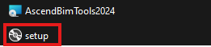
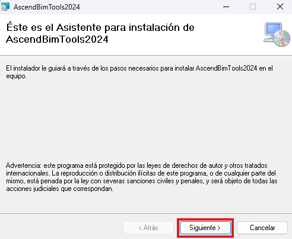
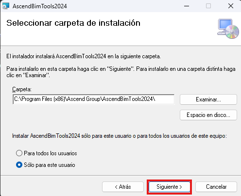
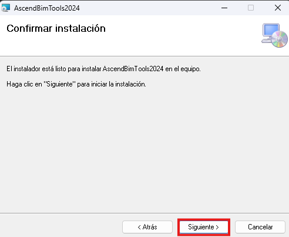
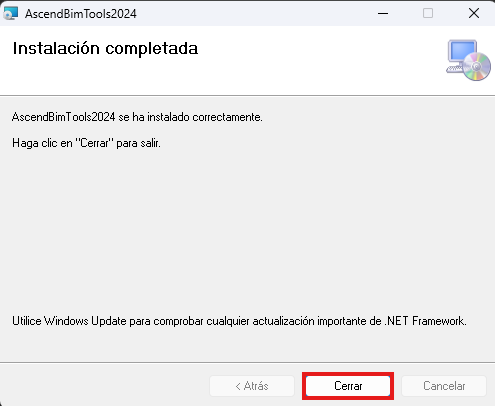

FormIA actúa como un agente inteligente que no solo responde a preguntas sobre los procesos BIM y procesos internos de tu compañía, sino que también ejecuta operaciones directamente en software BIM. Este agente de IA se integra en los proyectos desde la resolución de dudas hasta la creación de modelos detallados y la gestión de la ingeniería y fabricación.

## Tenemos un instalador para Autocad y otro para Bricscad.

| FormIA | Instalacion | Link de cada versión |
| - | - | -- |
| ACad | Manual | [FilesARXFormIA](https://github.com/Forsa-Ascend/FormIA/releases/download/FilesARXFormIA/FilesARXFormIA.rar) |
| BCad | Manual | [FilesBRXFormIA](https://github.com/Forsa-Ascend/FormIA/releases/download/FilesBRXFormIA/FilesBRXFormIA.rar) |

## Instalación
1. Descomprimir el archivo .rar en una carpeta.
2. Abrir el archivo con el nombre "setup".
- 
3. Se va abrir el asistente del instalador, vamos a clickear "siguiente".
- 
4. A continuacion solamente le clickeamos "siguiente".
- 
5. Procedemos con la instalación del programa le clickeamos "siguiente".
- 
6. Ya con el programa instalado finalizamos el proceso clickeando "cerrar".
- 

## Licencia
Para solicitar tu licencia contacta a Hugo Gomez en hugo.gomez@ascend.net.co.
